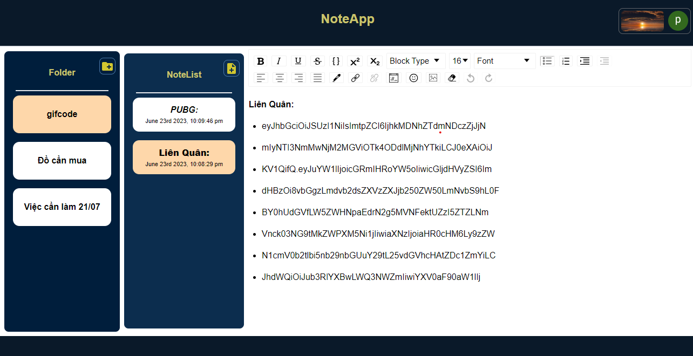

# **NoteApp**
**NoteApp** is a simple note-taking application built using ***ReactJS*** and ***NodeJS Express***. This application allows users to create, edit and delete personal notes. 

<p align="center"></p>

<p align="center"><u>Image: NoteApp</u></p>
<!-- 
Đây là logo của GitHub. -->

# **Table of contents**

- [**NoteApp**](#noteapp)
- [**Table of contents**](#table-of-contents)
- [**Introductions**](#introductions)
- [**Project structure**](#project-structure)
- [**Technologies**](#technologies)
- [**Install \& Config**](#install--config)
  - [***Install***](#install)
  - [***Config***](#config)
    - [**Config Firebase**:](#config-firebase)
    - [**Config Database**:](#config-database)
    - [**Config Domain Server**:](#config-domain-server)
- [**Feature**](#feature)
  - [***Main:***](#main)
  - [***Handle Error:***](#handle-error)
- [**Illustrations**](#illustrations)
- [**Deployment**](#deployment)
- [**Author**](#author)

# **Introductions**
The **NoteApp** project is divided into **two** main parts:

- ***Client Side***: Built using **ReactJS** and contains user interface components, functionality to interact and communicate with the server side via API.

- ***Server Side***: Built with **Node.js - Express** handles client requests, connects to the **MongoDB** database, and integrates user authentication via **Firebase Authentication**.
 

# **Project structure**

```
NoteApp/                  <Project>
├── client/               : Client-side source code directory, built using ReactJS.
│   ├── src/              : Folder source.
│   │   ├── component     : Small and reusable interface components.
│   │   ├── context       : Manage authentication status.
│   │   ├── firebase      : Configuration and connection information for Firebase.
│   │   ├── pages         : Contain main pages: Login, Home and ErrorPage.
│   │   ├── router        : Manage, configure and process routes.
│   │   ├── utilities     : API handling functions & Domain Server.
│   │   └── main.jsx      : React app initialization.
│   └── index.html        : The root HTML page of the ReactApp.
|
|
└── server/               : Server-side source code directory, built using Node.js Express.
    └── src/              : Folder source.
        ├── config/       : Contain Configurations.
        │   ├── db        : Configuration of Database (MongoDB).
        │   └── firebase  : Configuration of Firebase.
        ├── controllers   : Defind controllers Logical handling of requests from the client.
        ├── model         : Contains source code files that define and interact with the database.
        ├── routes        : Handle routes and HTTP requests from the client.
        └── index.js      : Server startup file, Install and configure Expressd.

```


# **Technologies**
* **Client**:` ReactJS, JavaScript, HTML, TailwindCSS, RESTful API.`
* **Server**:` NodeJS, Express, MongoDB, Firebase Authentication & Authorization`


# **Install & Config** 
## ***Install***
- Install the *dependencies* for the ***Client Side*** (**ReactJS**): ` express nodemon cors body-parser mongoose firebase-admin.`
    ```
    cd client
    npm install  
    ```
- Install the *dependencies* for the ***Server Side*** (**NodeJS Express**): `material tailwindcss react-router-dom firebase draft-js.`
    ```
    cd server
    npm install
    ```
## ***Config***
### **Config Firebase**:
- Client:
  - Create Firebase prooject and coppy 
  modular JavaScript SDK of Firebase.
  - Paste this to `\client\src\firebase\config.jsx`.
  
- Server:
  - coppy modular JavaScript SDK of Firebase, then paste this to `\server\src\config\firebase\FirebaseConfig.js`
  - Replace `from "firebase/app"`:
    ``` 
    import { initializeApp } from "firebase-admin/app"; 
    ```

### **Config Database**:
- Create account MongoDB online and create Note Database.
- Coppy the url of Database and paste it to  `\server\src\config\db\index.js`:
    ```
    const URI = "URL_DATABASE" 
    ```
### **Config Domain Server**:
- `\client\src\utilities\contains.jsx`
    ```
    export const NODE_SERVER = "domain_Server";
    ```
    
# **Feature**
## ***Main:***
- ***Folder***: 
  - **Create**
  - **Rename**
  - **Delete**
  - **Sort Folders in ascending order of create time.**
- ***Note***: 
  - **Create**
  - **Delete**
  - **Setname the note with the first line of the note**
  - **Sort notes in ascending order of edit time.**
- ***Login*** : with **google authentication**
- ***Authorization***: with **firebase authorization**
- ***Save status based on URL and manage navigation***: with **React-Router-DOM**.
  
## ***Handle Error:***
- ***Incorrect URL***
<video controls>
  <source src="./DataReadme/video/ErrorPage.mp4" type="video/mp4">
</video>

- ***Prevent invalid access before login***
<video controls>
  <source src="./DataReadme/video/MustLoginFist.mp4" type="video/mp4">
</video>
  
# **Illustrations**
<video controls>
  <source src="./DataReadme/video/NoteAppVideo.mp4" type="video/mp4">
</video>


# **Deployment**
**Deploy a Client (ReactJS) using [Netlify](https://www.netlify.com/)**:
- To implement the client (ReactJS), i use [Netlify](https://www.netlify.com/) which is a popular platform for hosting static websites and offers seamless integration with GitHub.

**Deploy a Server (Node.js Express) using [Render](https://render.com/):**
- For server deployment (Node.js Express), [Render](https://render.com/) is a suitable choice which is a cloud hosting platform that provides simplicity and scalability for my server-side applications.

> ***My project's deployment***: [**NoteApp**](https://main--comforting-moonbeam-02140b.netlify.app/)

# **Author**
***Name***: [**Dinh Trong Tung Son**](https://github.com/DinhSonpro12)

***Email***: dinhtrongtungson2626@gmail.com
***
**`If you have any questions or suggestions, feel free to contact me via email.`**


